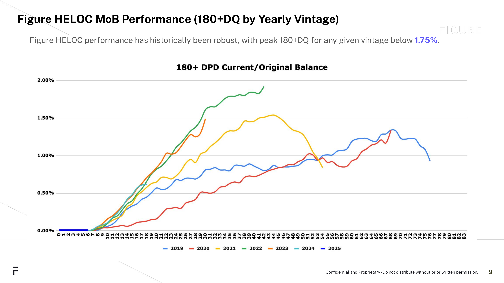

# Figure HELOC Performance: How to Read the Chart

## What the chart shows

This is a **cumulative severe delinquency curve** — the standard way to evaluate loan performance in structured finance (static pool analysis).

**Metric: 180+ DPD / Original Balance**

- **180+ DPD** (Days Past Due) = loans that are 6+ months behind on payments. At this stage, recovery is unlikely — this is effectively a proxy for default.
- **Current / Original Balance** = the delinquent dollar amount divided by the total original balance of that vintage. It's cumulative, so it only goes up.

**X-axis: Months on Book (MoB)** — how many months since origination. Month 12 = 1 year seasoned, month 24 = 2 years, etc.

**Each line = one origination year (vintage)** — 2019 through 2025.

## How to read it

If the 2022 line is at 1.75% at month 40, that means: of all the dollar volume Figure originated in 2022, 1.75% has gone 6+ months delinquent by the time those loans are ~3.3 years old.

## Key takeaways

- **All vintages peak below 1.75%** — losses are low and bounded
- **Curves flatten out** — after sufficient seasoning, new delinquencies largely stop. The "loss window" is finite.
- **Recent vintages (2024, 2025) are tracking at or below prior cohorts** — no deterioration in newer originations
- **Consistent across years** — the product performs predictably regardless of macro environment

## The chart

*Source: Figure Technologies — Figure HELOC Performance, October 2025. Confidential and proprietary.*

---

## Deck copy

Cumulative severe delinquencies (180+ days past due) have peaked below 1.75% across every origination vintage since 2019, with recent cohorts tracking at or below historical levels.
